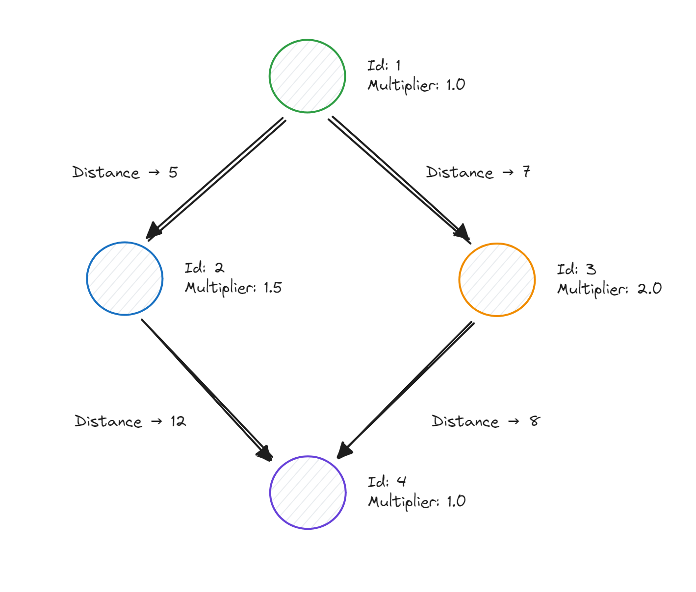
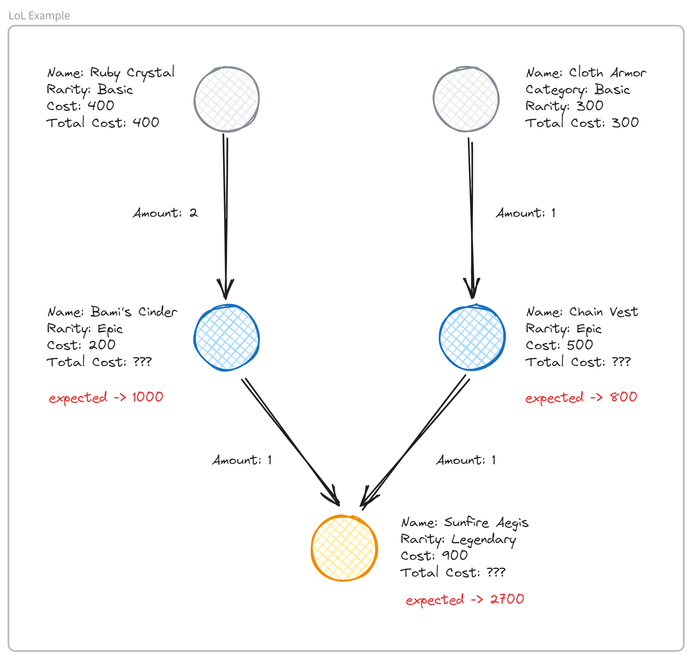

# 🍇 GraphX

Here are some PoCs I did to learn more about the GraphX API for Apache Spark.  
I did **two different exercises**, they are...

## Calculate the Distances

Our challenge here is to **calculate the sum of `distances (edges) * multipliers (vertex)` for each node in the tree**.



So, for example, the **expected** output for the **Node 4 (purple)** is 20 👇

```bash
Node ID → 4
Node Multiplier → 1.0
Edges → 12.0, 8.0

Expected Result = [12.0 * 1.0 + 8.0 * 1.0] = 20
```

> 📘 The code is in [this](distances.ipynb) notebook.

## LoL Items

Our challenge here is to **calculate the total price** of each item in the graph.



**Business Rules**  
If the item rarity is "Basic" then the `total_cost` is the item `cost`.  
Otherwise, the `total_cost` is the **sum** of the preivious items `total_cost * amount`..

> 💡 This challenge uses the "[Sunfire Aegis]" item.  
> 📘 The code is in [this](lol-items.ipynb) notebook.

[Sunfire Aegis]: https://leagueoflegends.fandom.com/wiki/Sunfire_Aegis

## Other Links

Articles that helped me to solve the next challenges.

- [Apache Spark: GraphX Programming Guide](https://spark.apache.org/docs/latest/graphx-programming-guide.html)
- [Medium - GraphX Pregel](https://towardsdatascience.com/spark-graphx-pregel-its-not-so-complex-as-it-sounds-d196da246c73)
- [Medium - Getting Started with GraphX](https://medium.com/data-hackers/introdu%C3%A7%C3%A3o-ao-spark-graphx-e-graphframes-9b10089f2e7f)
- [Geeks 4 Geeks - Pure Python Example](https://www.geeksforgeeks.org/calculate-sum-of-all-nodes-present-in-a-level-for-each-level-of-a-tree/)
- [Stanford - GraphX + Pregel](https://stanford.edu/~rezab/classes/cme323/S16/notes/Lecture16/Pregel_GraphX.pdf)
- [GraphX + Pregel - Official Docs](https://graphframes.github.io/graphframes/docs/_site/api/python/graphframes.lib.html#graphframes.lib.Pregel)

<br/>

🧙‍♂️ _"If in doubt Meriadoc, always follow your nose." - Gandalf_
