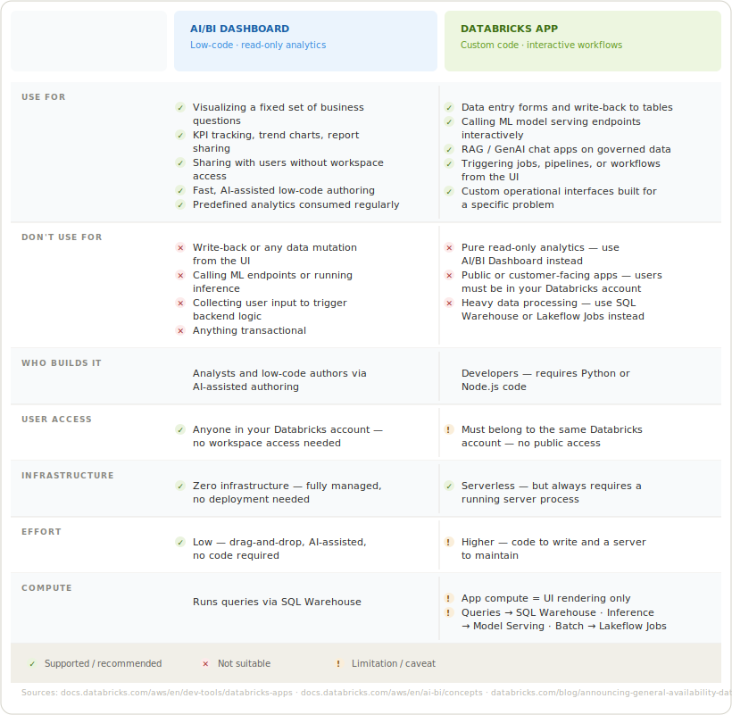

# Why Databricks Apps?

> ⚠️ **DISCLAIMER**  
> This is personal research notes, NOT official documentation.  
> Content may be outdated, always check the reference links for the most current information.

### What is Databricks Apps?

Applications come to the data, eliminating the gap between where data lives and where apps run.  
It packages analytics, AI, and transactional processing into a custom app built for a specific problem.

### Do's and Dont's

| ✅ When to use it | ❌ When NOT to use it |
|---|---|
| Interactive dashboards | Access or process data directly in app code |
| RAG chat apps | Public/customer-facing apps (requires Databricks identity) |
| Data entry forms | User auth unless authors are trusted and code is peer-reviewed |
| Custom operational interfaces | Heavy data processing (use SQL, Jobs, or Model Serving instead) |

### Why use it over hosting elsewhere?

- Serverless deploy across 28 regions, all three clouds
- Bring your own framework (Node.js, React, Streamlit, Dash, Gradio)
- Out-of-the-box SSO enforcing Unity Catalog user-level permissions
- Built-in audit logging and Git/CI-CD integration
- No replatforming, no data duplication, no security compromise

### 📊 Dashboards vs. Databricks Apps

- **AI/BI Dashboard** — read-only, predefined, fixed business questions
- **Genie Space** — natural language queries over your data
- **Databricks App** — anything transactional: write-back, job triggers, ML model calls, user input, RAG chat

The dividing line: **dashboards can't write or act — Apps can.**

🖼️ Dashboards vs. Apps

## 📚 References

- [Databricks Apps Overview — AWS Docs (May 2026)](https://docs.databricks.com/aws/en/dev-tools/databricks-apps/)
- [Announcing GA of Databricks Apps — Databricks Blog (Jun 2025)](https://databricks.com/blog/announcing-general-availability-databricks-apps)
- [Databricks One announcement — Newsroom (Jun 2025)](https://www.databricks.com/company/newsroom/press-releases/databricks-unveils-databricks-one-new-experience-bring-data-and-ai)
- [Best Practices for Databricks Apps — AWS Docs (Oct 2025)](https://docs.databricks.com/aws/en/dev-tools/databricks-apps/best-practices)
- [AI/BI Concepts — AWS Docs](https://docs.databricks.com/aws/en/ai-bi/concepts)
- [Key Concepts in Databricks Apps — AWS Docs](https://docs.databricks.com/aws/en/dev-tools/databricks-apps/key-concepts)
