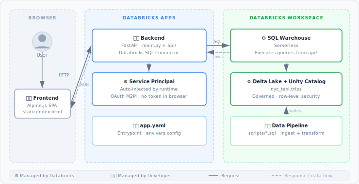

<div align="center">
  
  <h1>NYC Taxi App</h1>
  <p>End-to-end data pipeline demo — from raw NYC taxi data to a searchable web app, fully deployed on Databricks.</p>
</div>

<div align="center">


</div>

## Quick Start

```bash
# Install the Dependencies 👇
uv sync

# Running Locally 👇
# (1) Get your SQL Warehouse ID and export it, then start the app.
export DATABRICKS_WAREHOUSE_ID="$(databricks warehouses list --output json | jq -r '.[] | "\(.id)"')"

# (2) Start the App
# Use `--prepare-environment` if the .venv isn't created
# You may need to `source .venv/bin/activate`
databricks apps run-local --debug

# Production Deploy 🔥
./scripts/deploy.sh
```

## Pipeline

Run the gold table script directly in Databricks SQL.
It reads from `samples.nyctaxi.trips` and writes to `workspace.gold.nyctaxi_trips` with deterministic trip IDs and quality flags.

```shell
scripts/gold_nyctaxi_trips.sql
```

## API

| Method | Endpoint | Description |
|---|---|---|
| `GET` | `/health` | Health check |
| `GET` | `/api/trips/{trip_id}` | Fetch a trip by ID |

<details>
<summary>Sample Trip IDs 🚕</summary>

| trip_id | Description |
|---|---|
| `3eed23d2881bf5c439c98b379eb0d79f5597668b22a1f6c821d06a7a9de0e7c0` | All Checks Passed ✅ |
| `50019912b8ebac4fefed0f28a290cec5ac3be9bb3b9222136aed189455a03b94` | Checks Failing ❌ |

**Example**

```bash
curl http://127.0.0.1:8000/api/trips/<trip_id>
```

```json
{
  "trip_id": "a3f1...",
  "tpep_pickup_datetime": "2024-01-15T08:23:00",
  "tpep_dropoff_datetime": "2024-01-15T08:41:00",
  "trip_distance": 3.2,
  "fare_amount": 14.5,
  "pickup_zip": 10001,
  "dropoff_zip": 10003,
  "ingestion_timestamp": "2024-01-15T10:00:00",
  "record_quality_status": "VALID",
  "flag_invalid_fare": false,
  "flag_invalid_distance": false,
  "flag_invalid_timestamp": false,
  "flag_unrealistic_distance": false,
  "flag_unrealistic_fare": false,
  "flag_zero_distance_paid": false
}
```

</details>

## Architecture



## References

- [FastAPI docs](https://fastapi.tiangolo.com/)
- [Databricks SQL Connector](https://docs.databricks.com/en/dev-tools/python-sql-connector.html)
- [Databricks Apps](https://docs.databricks.com/en/dev-tools/databricks-apps/index.html)
- [Databricks Apps — App Development](https://docs.databricks.com/gcp/en/dev-tools/databricks-apps/app-development)
- [Alpine.js](https://alpinejs.dev/)
- [Research]
  - [Why Databricks Apps?](.docs/why-databricks-apps.md)
