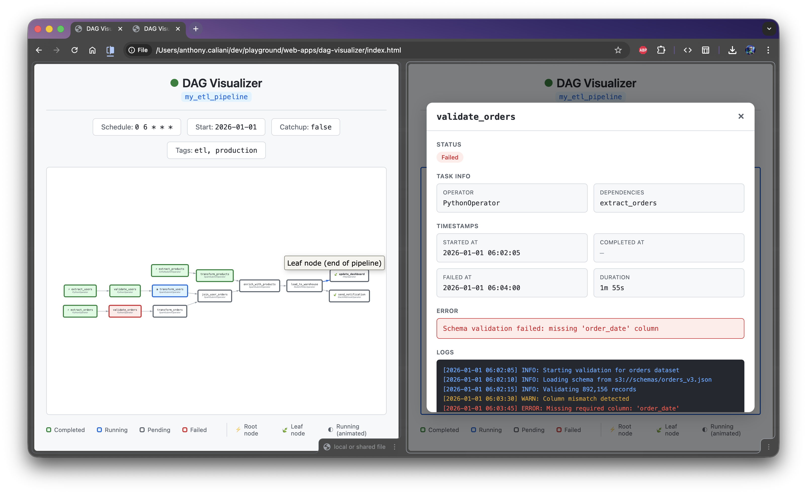

# DAG Viz 🧭

> 🤖 This web page was 100% generated using AI.

### Why did I created this?

I wanted to know how hard would be to create a dynamic DAG in a HTML page.

At the time, I had some ideas in mind that this could be useful.

> 💡 Am I going to use?
> Idk, but this took me 30m tops... So, why not? ¯\_(ツ)_/¯

To run, there's no mistery, you just have to open the `index.html` file.

### What can I learn from this code snippet?

  1. [vis-network](https://github.com/visjs/vis-network) a Graph JS lib.
  2. [Alpine.js](https://alpinejs.dev/) an modern alternative for jQuery.

### Result

